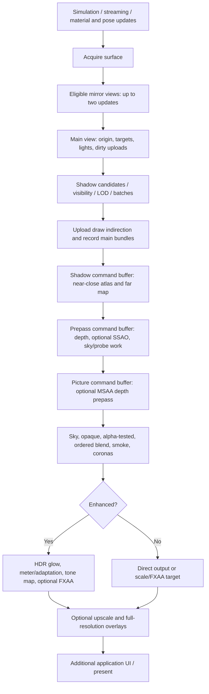

# Rendering pipeline technical audit

**Baseline:** commit `e8f101c` (working tree inspected 2026-09-29 UTC).  
**Scope:** application render dispatch, scene uploads, wgpu renderer, WGSL shading,
texture preparation, mirrors and presentation. This is a source-based architectural
audit, not a measured GPU profile. No renderer behavior was changed. Historical
performance numbers in source comments and architecture documentation are not
measurements from this audit; proposed savings require the experiments below.

## 1. Pipeline Architecture & Execution Flow

### 1.1 Architecture and existing optimizations

The renderer is **forward, indexed and instanced**, with optional depth/SSAO passes,
three sun-shadow cascades, and a separate enhanced HDR/post-processing path. It is
not a deferred G-buffer renderer. The CPU builds visibility and draw lists; wgpu
handles backend command translation, resource transitions and submission. The
main GPU work here is raster render passes, not a compute-driven draw pipeline.

Primary implementation references (line numbers refer to the baseline):

| Responsibility | Source and entry point |
| --- | --- |
| Window dispatch, mirrors, surface acquisition/presentation | [app_events.rs](../crates/omsi-app/src/app_events.rs), around lines 1660–1819 |
| Mirror visibility and camera setup | [camera_util.rs](../crates/omsi-app/src/camera_util.rs), `render_mirrors`, line 303 |
| Scene staging, uploads and texture replacement | [scene.rs](../crates/omsi-app/src/scene.rs), `stage_tile`, `upload_tile`, `apply_texture_upgrades` |
| Main pipeline | [renderer](../crates/omsi-render/src/lib.rs), `render_inner`, line 6350 |
| Instancing and command recording | [renderer](../crates/omsi-render/src/lib.rs), `batch_items`, `encode_batches_filtered`, `record_bundles`, lines 8837, 8898, 9001 |
| Vertex/material shading | [shader.wgsl](../crates/omsi-render/src/shader.wgsl), `vs_main`, `fs_main` |
| Enhanced fragment shading | [enhanced.wgsl](../crates/omsi-render/src/enhanced.wgsl), `shade_enhanced` |
| SSAO and post-processing | [ssao.wgsl](../crates/omsi-render/src/ssao.wgsl), [post.wgsl](../crates/omsi-render/src/post.wgsl) |

Already present; do not propose these as entirely new features:

- Dirty-instance updates with merged upload ranges and capacity-based buffer reuse.
- Instanced batches of identical mesh range/material/pipeline; redundant state binds suppressed.
- Bounding-sphere frustum culling, distance/screen-size limits, authored LOD selection,
  and main-view visibility/size hysteresis.
- Clockwise content-mesh back-face culling, disabled for mirrored transforms.
- Cached/throttled shadow cascades, a scheduled sky cube, asynchronous sky preparation.
- BC texture support, worker-side preparation, late texture replacement and memory budgeting.
- Parallel main-pass bundle recording and command-buffer finishing above thresholds.
- Visibility-filtered, rate-limited mirrors and optional render scaling.

**Documentation discrepancy:** [ARCHITECTURE.md](ARCHITECTURE.md), Threading,
says culling is parallel. The current visibility loop in `render_inner` is sequential
(lines 6950 onward); its comment explains that worker hand-off under simulation load
cost more than the culling work. Use implementation, not that historical statement,
as the optimization baseline.

### 1.2 Frame graph and execution order



Arrows express resource/order dependencies, not CPU/GPU synchronization after each
stage. The three command buffers are finished in parallel for sufficiently large
workloads, then submitted in **shadow → prepass → picture** order on one queue.
Each selected mirror invokes the renderer separately before the main view.

### 1.3 CPU preparation, resources and visibility

1. **Scene preparation and streaming.** Tile preparation and asset work feed the
   application's scene integration. Dynamic transforms/material slots and posed
   meshes update renderer data. Texture upgrades are prepared on a background pool;
   completed resources are swapped and affected materials rebound in
   [apply_texture_upgrades](../crates/omsi-app/src/scene.rs), line 6880.
2. **Floating origin.** Each render call rounds its camera position down to a 100 m
   grid. World positions remain double precision on the CPU, while relative model
   and camera data sent to the GPU use floats. Origin changes invalidate instance
   preparation; mirrors and the main camera can select different cells.
3. **Instance storage.** [prepare](../crates/omsi-render/src/lib.rs), line 5629,
   keeps one 64-byte model matrix and two 16-byte parameter vectors per material-slot
   entry, with CPU copies. It appends where capacity permits, updates changed entries,
   or rebuilds on invalidation. A 4096-entry merge-gap policy trades fewer queue writes
   for uploading unchanged entries between dirty ranges.
4. **Mesh updates.** [update_mesh](../crates/omsi-render/src/lib.rs), line 3667,
   constructs interleaved vertices, retains the latest pending update per mesh, and
   recomputes bounds. `flush_pending_meshes` writes each mesh separately before
   submission; the source explicitly rejects an unbounded, whole-frame staging buffer.
5. **Lights.** [prepare_lights](../crates/omsi-render/src/lib.rs), line 5922,
   builds a camera-relative 64×64 XY grid of 25 m cells, with 32 light indices per
   cell. Interior lights have direct indices. Unchanged GPU light/grid bytes are not
   re-uploaded, but the CPU still reconstructs and compares the data per view.
6. **Visibility.** Each active shadow cascade scans candidate instances independently.
   The camera scan applies visibility, mirror-only rules, transformed sphere/frustum,
   fog/distance, object-size and LOD tests. Enhanced terrain/large-bound exceptions
   prevent fog culling from opening holes. No scene occlusion-culling stage is present
   in this render path; depth rejection is not CPU draw culling.
7. **Batch construction.** Opaque/alpha-tested draw items sort by
   `(pipeline, mesh, range, material)` and identical items become indexed instanced draws.
   Shadow/depth opaque batches can share a material identity. A storage draw list maps
   GPU instance indices back to material-slot entries.
8. **Transparency.** Blended objects sort by containment rank and nearest blended-mesh
   distance; creation order resolves ties within an object. The player's enclosing
   bus comes last. Only adjacent compatible transparent draws merge. This ordering
   is a content compatibility requirement, not freely sortable state overhead.

### 1.4 Vertex processing, clipping, rasterization and output merging

- The vertex shader reads `draw_list[instance_index]`, fetches model/slot data,
  transforms position and normal, applies animated UVs and projects the vertex.
  Road/surface vertices receive a view-direction depth pull without changing their
  apparent screen position. Hidden entries collapse out of view.
- GPU primitive assembly, homogeneous clipping, face culling and rasterization follow.
  Content uses clockwise front faces. Camera depth is reversed-Z, `Depth32Float`,
  cleared to zero and tested with `GreaterEqual`; shadow maps use conventional depth,
  cleared to one with a `LessEqual` comparison sampler.
- `vs_main` declares invariant clip position so the depth and color passes agree.
  Preserve its calculations and surface bias when changing either pass.
- Pipeline variants encode alpha mode, back-face culling and surface bias. Ordinary
  blended materials can **write depth**; no-Z-write/no-Z-check materials take special
  handling. A generic "all transparent objects disable depth writes" change is unsafe.
- Alpha-tested color draws use alpha-to-coverage under MSAA. The enhanced MSAA depth
  prepass deliberately omits ordinary alpha-tested batches: binary-cutout depth would
  hide geometry behind uncovered foliage samples. Eligible blended transmap materials
  contribute only their opaque pixels to the prepass.
- Fragment work includes diffuse/transparency/night/light/environment/bump/PBR maps,
  dynamic lights, shadow comparisons, weather and fog. Enhanced adds GGX/IBL shading;
  its cascade filter avoids sampling both cascades where only one contributes.
- Main output order is sky, opaque/alpha-tested batches, sorted blended batches,
  smoke and additive coronas. Depth/blend tests combine the result with attachments.
  Early-depth savings depend on shader/backend behavior; a prepass does not guarantee
  exactly one fragment invocation per visible pixel, especially with discard and blend.

### 1.5 Pass resources, lifetime and synchronization

| Pass/resource | Writes → subsequent reads and relevant behavior |
| --- | --- |
| Shadow maps | Near/close share a two-wide depth atlas; far has a separate depth texture. Main shading samples them. Close refreshes every main frame, near normally every second, far every fourth, with camera/sun/origin invalidations. |
| Camera depth and AO | Single-sample full-resolution depth feeds half-resolution SSAO and blur. Single-sample main rendering reuses this depth. SSAO uses 12 hemisphere samples; blur has a 6×6 footprint. |
| MSAA depth | Enhanced MSAA adds a separate compatible depth prepass; the single-sample prepass still supplies AO when enabled. |
| Sky/probe | Scheduled sky-cube updates and filtered reflection-probe render passes precede their consumers. These are sky reflections, not six full scene renders. |
| Enhanced color | `Rgba16Float` plus an `R8Unorm` display-protection mask; MSAA attachments resolve into single-sample textures. Resolved multisample colors are discarded rather than stored. |
| Enhanced post | Downsample/glow chain, main-view metering, ping-pong exposure adaptation, upsample chain, tone map and optional FXAA. Masked vehicle displays are protected from glow/FXAA changes. |
| Final output | Optional smaller scene target is upscaled; HUD overlays stay at window resolution. Vanilla full-resolution FXAA uses an intermediate target when MSAA is off. |
| Readback | `render_to_image` allocates color/readback resources, copies padded rows, waits for completion and returns RGBA8. It forces instant exposure: useful for snapshots, not representative of live adaptation or frame overlap. |

wgpu tracks attachment-to-sampling and buffer-use transitions; this code does not
insert explicit Vulkan-style barriers. `queue.write_buffer` data is ordered with
submission. Combining mirror/main submissions without separate per-view uniforms
and draw lists could make earlier views consume later view data; preserve this
ordering contract when reducing API calls.

Render targets are cached by size with age/count eviction. There is one AO target set;
resizing it invalidates camera bindings, instance preparation and HDR targets.
Mirrors normally use vanilla shading even when the window is enhanced, disable sun
shadows/AO, use a 450 m far distance and a fixed 1.6 aspect. The enhanced-mirror override
is a distinct path that must be tested separately.

## 2. Bottleneck Analysis & Optimization Opportunities

### 2.1 Ranked, source-supported candidates

Priorities express investigation order, **not proven speedups**. All entries are
observed mechanisms with workload-dependent performance impact.

| Priority / ID | Evidence and possible bottleneck | Action and measurement |
| --- | --- | --- |
| P1 / O1 | `nearest_by_origin` performs linear searches while building distinct groups; blended-key construction searches again, plus holder membership scans. For B blended meshes and G object origins this can approach O(B×G). [Source](../crates/omsi-render/src/lib.rs): 7189–7300, 8798. | Build a per-view origin lookup once without changing sort keys/order. Measure `items` time versus B/G on crowded glass-heavy scenes. |
| P1 / O2 | `msaa_targets` allocates both surface-format color and depth. Enhanced MSAA uses HDR-owned color instead; vanilla single-sample without a prepass also selects the direct scene target, leaving helper color unused. [Source](../crates/omsi-render/src/lib.rs): 5196, 7644–7745. | Split color/depth allocation by actual consumers. Count allocations and resident bytes; verify all fallback/resize paths. A redundant 1920×1080 RGBA8 4× target represents about 31.6 MiB of logical storage, before backend overhead. |
| P1 / O3 | Main bundles are reconstructed each view. Above thresholds, `record_bundles` and command finishing spawn scoped OS threads each call. [Source](../crates/omsi-render/src/lib.rs): 7359, 8013, 9050. | Measure worker start/join cost, bundle/finish time and contention under traffic load. Trial a bounded persistent encoding pool, with a sequential small-work fallback. |
| P1 / O4 | Per-view vectors/maps, per-slot matrices and merged dirty ranges create allocation/upload traffic. A 4096-entry gap can bridge roughly 384 KiB of unchanged model/parameter data per gap. [Source](../crates/omsi-render/src/lib.rs): 5585–5757, 6738, 6958. | Reuse bounded scratch capacity; measure bytes, writes and allocations separately. Benchmark a byte-cost-aware range merge, not merely smaller gaps. |
| P2 / O5 | Lights rebuild a 64×64×32 index grid per view: 512 KiB of CPU initialization before insertion/comparison, even when no GPU update is needed. [Source](../crates/omsi-render/src/lib.rs): 5922. | Cache by light revision, grid origin, render origin and shading mode; maintain interior-light ordering. Measure `setup` and actual grid upload count across mirror/main calls. |
| P2 / O6 | Each refreshed cascade and each view scans instances; bounds/scale calculations repeat. A mirror near an origin boundary can alternate the scene origin with the main camera, causing full uploads. [Source](../crates/omsi-render/src/lib.rs): 6430, 6767, 6958. | Start with cached transformed bounds and a conservative spatial broad phase. Measure candidate counts and full rebuild frequency during 100 m boundary crossings before considering a shared frame origin. |
| P2 / O7 | Enhanced MSAA always enables the single-sample prepass, then adds the MSAA prepass; when AO is disabled the former is not shared as main depth. [Source](../crates/omsi-render/src/lib.rs): 6474, 7644. | Audit all depth consumers and trial skipping unused single-sample work only for enhanced+MSAA+AO-off. Keep the compatible MSAA prepass and its alpha exclusions. Measure both prepass time and total GPU time. |
| P2 / O8 | Texture-upgrade deadline is checked around replacements, but subsequent `rebind_textures` work is outside that loop's deadline. Pending skinned meshes also allocate/copy bytes and search updates linearly. [Source](../crates/omsi-app/src/scene.rs): 6880; [mesh updates](../crates/omsi-render/src/lib.rs): 3667. | Account for upload plus rebind cost in the integration budget; measure p99 streaming frames. Reuse per-mesh staging storage before attempting GPU skinning. |

Additional constraints on these candidates:

- **O2** is a memory-saving hypothesis directly supported by attachment selection,
  not a promise of proportional frame-time savings. Avoid a generic render-graph
  rewrite just to remove an unused attachment.
- **O3** should not blindly move work onto the already busy simulation Rayon pool.
  The sequential culling decision is evidence that contention matters here.
- **O4** must bound retained capacity; otherwise peak city scenes permanently inflate
  memory after unloading. A completely new matrix/slot layout increases scope and
  shader risk; attempt scratch reuse and upload tuning first.
- **O6** must not reuse main-camera visibility for mirrors or shadow casters: offscreen
  objects can be visible in reflections or cast onto visible receivers.

### 2.2 GPU execution and bandwidth pressure

**Fragment/overdraw candidates**

- Enhanced materials combine many texture reads, per-cell lights, soft shadow taps,
  procedural weather and reflection sampling. Dense foliage, rain-covered glass and
  layered vehicle materials can remain expensive despite opaque depth rejection.
- MSAA multiplies attachment storage and can increase coverage/shading work; it also
  changes cutout behavior. Resolution/MSAA sweeps diagnose fill/bandwidth limits but
  are quality-changing experiments, not automatic recommendations to lower defaults.
- Shadow passes repeat geometry and alpha texture sampling. Existing refresh cadence,
  minimum caster sizes, authored LOD and cascade filter branching already reduce this.
  Further reducing cadence/filter quality risks temporal or visual regression.
- SSAO reconstruction/blur and HDR glow/FXAA are additional full/partial-screen work.
  Inspect per-pass time before adding more prepasses, fusing passes or changing filters.

**Memory/cache candidates**

- Material batches sort by mesh/range before material: this favors geometry reuse, not
  necessarily minimum texture switches. Compare bind counts and GPU cache behavior
  before changing the key; transparent order is immutable and opaque coplanar ties
  may also be order-sensitive.
- Model matrices are repeated per slot and accessed via draw indirection. Measure
  vertex bandwidth before separating per-instance transforms from per-slot parameters.
- Existing BC1/2/3 support and mip chains already cut texture bandwidth. New compression
  is lossy; quality gates (33 dB color, 30 dB alpha, stricter bump alpha) in
  [gpu.rs](../crates/omsi-texture/src/gpu.rs) are not proof of identical rendered edges.
- At shadow size S, near/close atlas plus far map contain approximately 12×S² bytes
  of depth texels (192 MiB at S=4096), before allocation overhead. Account for this,
  HDR/MSAA intermediates, mesh buffers and transient uploads—not just texture assets.
- Inspect upload/rebind bursts and target churn during resizing/dynamic scaling.
  Average throughput can conceal allocator and bandwidth spikes.

### 2.3 Measurement gaps and interpretation

Existing instrumentation is valuable but does not establish an exhaustive profile:

- `OMSI_PROFILE` records renderer/application CPU stages; `OMSI_DEBUG_DRAWS` exposes
  instance/draw/batch counts. Verbose debug logging should be disabled for timing runs.
- `OMSI_GPU_TIMERS=1` requests supported timestamp queries. Main and mirror timing
  sets are separate; readbacks are asynchronous and skip frames while outstanding.
  Unsupported timestamp features mean missing data, not zero GPU cost.
- [GpuTimers::collect](../crates/omsi-render/src/lib.rs), line 6066, attributes intervals
  by sorted **pass end timestamps**, starting the first interval at its own start.
  Untimed work can be charged to the next label. These are not isolated pass durations:
  `glow+meter` includes preceding untimed post work, while `probe` timestamps only one
  subpass directly. There is also a 16-timed-pass cap.
- The aggregate `shadow batches` count sums near and far, omitting close; the separate
  triangle counters do include close. Do not use that count alone to estimate work.
- `OMSI_BENCH` repeats a static final picture, updates one mirror each iteration when
  a player exists, and waits on the GPU every iteration. It cannot establish live
  simulation/streaming p99 or production CPU/GPU overlap. CPU encode time plus residual
  wait is not an independently measured CPU time plus full GPU duration.
- [render_to_image](../crates/omsi-render/src/lib.rs), line 8048, includes allocation,
  synchronous readback and instant exposure. Use it for images, not steady-state FPS.

Collect upload bytes/write calls, material/mesh/pipeline bind counts, full-rebuild
reasons, candidate/visible counts, target bytes and per-frame timings in a controlled
benchmark branch. Use a backend GPU capture for fragment occupancy, cache/bandwidth
and actual pass dependencies. No such capture or runtime performance measurement was
performed for this documentation-only audit.

## 3. Performance Tuning Without Visual/Functional Regression

### 3.1 Preservation contract

Treat the current renderer, with identical content/settings/history, as the baseline.
Prefer changing the amount of CPU bookkeeping over changing which pixels are drawn.

- Preserve selected instances, material-slot values, draw order, alpha cutoffs,
  depth writes, winding, surface bias and texture color spaces.
- Preserve mirror scheduling and independent cameras, display-mask behavior,
  shadow invalidation, exposure history and origin-relative precision.
- Preserve simulation ticks, script execution, collision/picking, streaming ownership
  and resource lifetimes. Render visibility must never disable simulation behavior.
- Preserve deterministic ordering explicitly: hash-map iteration and worker completion
  order must not determine draw order, transparent ties or light overflow selection.
- Byte-identical images are a suitable first gate for CPU-only changes on the same
  backend with frozen input/history. Cross-driver floating-point results and genuinely
  lossy techniques need separately agreed tolerances; they cannot promise bit identity.

### 3.2 Concrete changes and acceptance tests

Each candidate must pass both the listed checks and the common replay/performance
gates in §3.3. Do not combine several candidates in one initial comparison.

| Candidate | Non-destructive implementation boundary | Visual / functional / deterministic verification |
| --- | --- | --- |
| O1: indexed blend grouping | Replace searches, not the `(rank, distance, instance-index)` comparator. Preserve `DVec3` equality: bit keys must canonicalize signed zero and handle non-finite coordinates conservatively. | Compare old/new keyed sequences and batches exactly; cover equal origins/distances, surfaces, nested/own bus, NaN handling, rain/glass and a passing car. Measure `items` p50/p99 with fixed scene inputs. |
| O2: allocate only used targets | Separate depth from optional LDR color; keep sample counts, formats, resolve/store operations and fallback lifetimes unchanged. | Render vanilla/enhanced × supported MSAA × AO on/off, scaled/unscaled, mirrors, resize and single-sample fallback. Require same images, no wgpu validation errors and reduced allocation/byte counters; check resize p99. |
| O3: reuse encoding workers | Bounded workers with explicit ordered result slots; maintain synchronous ownership/join before submission and the small-work path. Avoid persistent bundle caching initially. | Compare command/batch ordering and images, stress worker contention and device failure, track p99 not just mean; verify no simulation-state changes or accumulating jobs. |
| O4: reuse scratch / tune dirty writes | Keep vector order and identical GPU bytes; merge only initialized valid ranges. Bound memory retention and respect device buffer limits. | Compare prepared buffers and uploaded ranges against the old path after add/remove/recycle/material changes and origin shifts. Match images and simulation state; measure upload bytes, queue calls, allocations and tail latency. |
| O5: cache light preparation | Key all dependencies; retain original insertion order and first-32-per-cell policy, including `LightMode` and interior indices. | Byte-compare light/grid buffers with a recomputed reference after lamp toggles, moves, deletion/reuse, >32 overlapping lights, day/night, mirror cameras and origin changes. Measure CPU savings and bounded cache memory. |
| O6: conservative culling/bounds reuse | Add a spatial broad phase whose output is a superset of current candidates; retain current narrow phase and LOD/hysteresis exactly. Dirty animated, scaled, mirrored, moved and streamed bounds. | Compare visible sets/draw sequences with the reference per view. Test frustum edges, camera-inside, high-altitude fog, LOD thresholds, teleports and 100 m boundaries. Stable instance ordering must survive spatial traversal. |
| O7: eliminate demonstrably unused depth work | Restrict to enhanced+MSAA+AO-off after checking every shader/bind-group consumer; do not remove the MSAA prepass or change its alpha policy. | Compare foliage over buildings/sky, transmap vehicle bodies, decals, interiors and display masks. Test AO toggling/resize and all supported sample counts. Require identical images and lower total GPU time without a tail penalty. |
| O8: bound integration/staging cost | Reuse mesh staging; budget texture replacement plus dependent rebinds as an atomic render-visible operation. Defer a whole upgrade rather than exposing mixed old/new resources. | Compare posed vertices/bounds and final texture/material generations; stress release/reuse during uploads, dynamic displays and low-memory scenes. Measure streaming p99 and time-to-ready; changed upgrade timing requires explicit acceptance even if final pixels match. |

**Follow-on techniques with higher risk**

- **Occlusion culling:** consider conservative hierarchical-Z only after broad-phase
  savings are measured. With reversed-Z, reduction/comparison must prove the object
  hidden over its entire projected bound; uncovered pixels prevent rejection. Start
  with opaque static occluders, include bias/depth-pull expansion, exclude uncertain
  cutouts/no-Z surfaces, and render on uncertainty. Previous-frame results need
  camera/object-motion disocclusion protection and invalidation on teleports/origin
  shifts. Verify against an uncullled reference over trajectories, not single images;
  test latency without synchronous query readback. This is not a low-risk first patch.
- **LOD:** authored LOD and hysteresis already exist. Cache selection work rather than
  reducing thresholds or introducing new simplified meshes. Main object-size history
  and shadow LOD calculations are not identical (the latter uses fresh size): unifying
  them is a behavior change requiring threshold-crossing image sequences. New LOD assets
  or aggressive screen-size cutoffs belong behind an explicit quality setting.
- **Instancing/bundle reuse:** extend existing sharing only when full material/resource
  identity and draw order agree. Persistent bundles require invalidation for batch
  membership, ranges, buffers, bind groups, slot recycling, formats and samples.
  Compare flattened draw sequences and exercise texture replacement before accepting.
- **Texture compression:** preserve native compressed payloads/mips where supported.
  Do not silently lower existing quality gates or recompress dynamic text. Additional
  codecs/platform support need capability fallbacks, alpha-coverage and normal/bump
  tests, plus close-up and moving minification comparisons. Lossy changes cannot satisfy
  a strict pixel-identical contract even if a global PSNR threshold passes.
- **Pass/draw reordering:** benchmark front-to-back ordering only within legally
  reorderable opaque groups; compare coplanar/tie surfaces before changing defaults.
  Never globally state-sort transparency or move overlays ahead of tone mapping.
  Avoid splitting the main pass solely for CPU parallelism: the code records that
  attachment reloads hurt tile-based GPUs. Pass fusion must preserve filtering,
  intermediate precision and exposure dependencies and be tested per backend.
- **Quality knobs:** lower render scale, shadow resolution/filter taps, mirror rate,
  SSAO samples or MSAA are valid user trade-offs—not regression-free optimization.
  Keep them separate from the acceptance criteria for O1–O8.

### 3.3 Reproducible validation protocol

**A. Establish equivalent input and histories**

- Record revision, release profile, backend/adapter/driver, dimensions, actual render
  scale, MSAA, AO/FXAA, graphics mode, texture budget, content identifiers and settings.
  Use licensed local OMSI content; do not commit game assets or distribute captures
  containing assets without permission.
- Fix the situation, camera/input sequence, simulation step, weather/time and population
  seeds where supported. No general `--seed` option is assumed. If a subsystem lacks a
  controllable seed, replay captured scene inputs or isolate it for the equality test.
- Control resource readiness and shadow/sky/exposure history. Renderer `Instant` time,
  worker completion and dynamic scaling mean "same camera" alone is not deterministic.
  A frozen render-clock/history test hook would be new test work, not an existing feature.
- Run both cold streaming and warmed steady-state cases; do not average them together.

**B. Use the existing probes, with their limitations**

Example static microbenchmark after building the release application according to
[BUILDING.md](BUILDING.md); `$OMSI_ROOT` must point to a local licensed installation:

```bash
OMSI_PROFILE=1 OMSI_GPU_TIMERS=1 OMSI_BENCH=600 OMSI_BENCH_FRAMES=1 \
  ./target/release/openomsi --root "$OMSI_ROOT" \
  --map maps/Grundorf/global.cfg --offscreen /tmp/render-baseline.png \
  --size 1920x1080
```

Repeat with a separate output for the candidate, identical settings and explicitly
chosen cameras; add `--enhanced` to exercise HDR. This example does not spawn a bus,
so it does **not** benchmark mirrors. Add a known installed `--bus` for vehicle tests.
Use the windowed scripted/route workload for real mirror scheduling, traffic and
streaming; offscreen `--snapshots` helps image comparisons but forces instant exposure.
Compare `OMSI_NO_BUNDLES=1` only as a controlled A/B diagnostic. Avoid simultaneous
profiling runs on shared hardware. Profiling itself can affect timings.

**C. Required scene matrix**

- Sparse daytime Grundorf versus dense city traffic and foliage.
- Driver, passenger, outside, free and mirror views; multiple visible mirrors.
- Night/headlights/interior lamps; bright-to-dark exposure transitions.
- Rain films, layered dirt/glass, snow, fog from ground and elevated cameras.
- Bridges, road markings, ground paint, shadow blobs and coplanar decals.
- Authored LOD thresholds, reverse transforms, animated doors/people and camera-inside bounds.
- Streaming/unloading, slot reuse, texture-budget drop/restore, display updates,
  origin-boundary crossings, teleport, resize and device/MSAA fallback.
- Available Vulkan, Metal and D3D12 adapters; supported fallback/mobile paths where deployed.
  Record unsupported configurations rather than claiming coverage.

**D. Pass/fail gates**

- Run existing focused renderer tests (`cargo test -p omsi-render --lib`) after code
  changes; these include shader/uniform validation and behavioral helpers. Run texture
  tests (`cargo test -p omsi-texture --lib`) for texture changes. These do not replace
  full-scene GPU image and replay tests; neither command was needed for this report.
- For CPU bookkeeping changes, require identical visibility, sorted draws, light/slot
  buffers and frozen same-backend images. For unavoidable floating-point changes,
  establish tolerance from repeated baseline runs first; inspect max error, changed
  pixels and regions around glass, thin edges, displays and shadows—not only mean error.
- Compare whole sequences for popping, shimmer, shadow/exposure lag and mirror cadence.
  Hash simulation state at fixed ticks (excluding profiling/wall-clock metadata) to
  detect functional or worker-order regressions. Cross-GPU bit identity is not assumed.
- Use at least five paired baseline/candidate runs of the same warmed route. Report
  CPU/GPU timing separately, frame p50/p95/p99 and worst frame, plus memory/upload peaks.
  Preserve the production overlap/presentation mode for live frame measurements.
- Accept a change only when improvement exceeds measured run-to-run noise and p99,
  memory, resource readiness and image/state gates do not regress. Predeclare project
  thresholds rather than selecting favorable metrics after the run. Keep each
  optimization independently revertible.

### 3.4 Recommended delivery order

1. Establish representative paired baselines and add only missing counters.
2. Trial O1 and O2 independently: explicit algorithmic/allocation waste, small scope.
3. Trial O4/O5, then O3 under realistic simulation contention.
4. Validate O7's consumer assumptions; address O8 if streaming tails dominate.
5. Pursue O6 spatial acceleration only when scans demonstrably dominate; defer Hi-Z,
   new LOD assets, new compression and render-architecture changes until justified.

**Bottom line:** the renderer already contains substantial batching, culling, compression
and temporal work reduction. The safest remaining opportunities are redundant CPU work,
unused allocations and bounded resource integration—not silently reducing visual quality.
No performance gain or regression-free outcome is claimed until measured against these gates.
